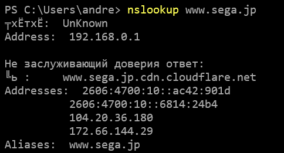
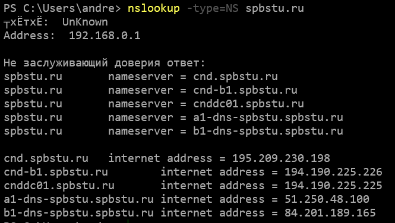
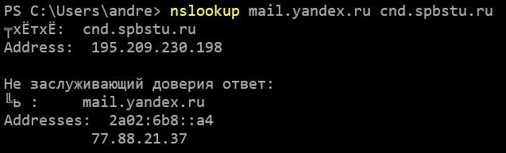
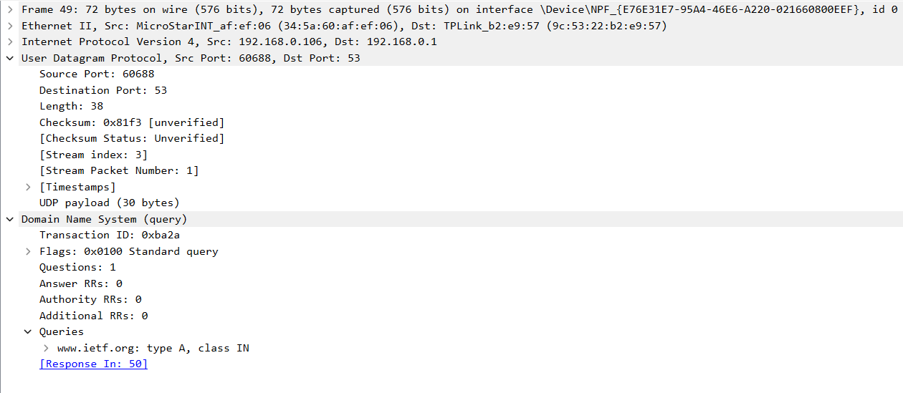
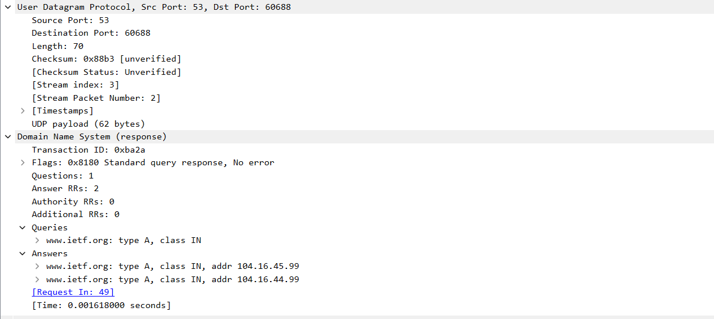
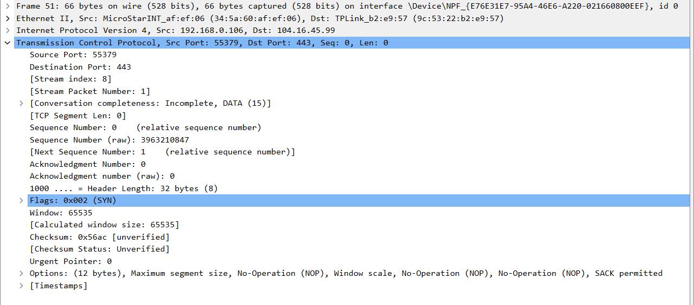
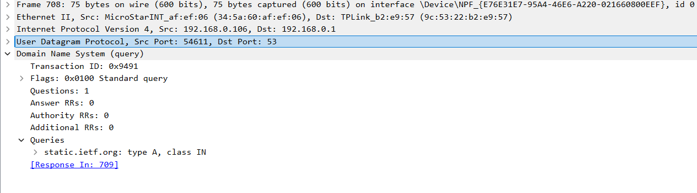
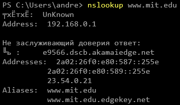
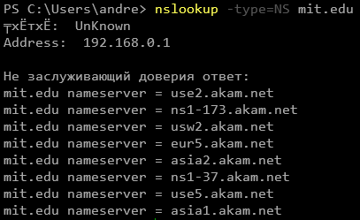
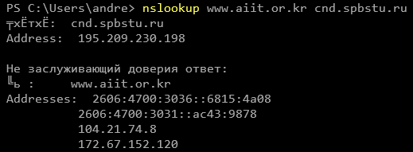

# NSLOOKUP

1. nslookup к серверу в Азии

Кодировка сломана в силу использования русской версии ОС Windows.

Локальный DNS-сервер расположен на маршрутизаторе (192.168.0.1).

2. Определение авторитетных серверов сайта университета

3. Запрос с помощью сервера СПбПУ

# WIRESHARK

## 4-10

Захват DNS-пакетов при запросе неизвестного адреса в браузере. Полный захват всех пакетов приведен в файле dns_web.

Запрос DNS: по протоколу UDP на порт 53 локального DNS-сервера, тип запроса А.

Ответ также по протоколу UDP с порта 53 дает 2 адреса

Последующий TCP-запрос SYN отправляется на один из этих адресов

Часть изображений расположены на другом сервере, для определения его адреса также выполняется DNS-запрос:

## 11-15

Захват DNS-пакетов в nslookup. Полный файл захвата dns_nslookup.

Отправлено 3 DNS-запроса: тип PTR (определение DNS-сервера по умолчанию 192.168.0.1), тип A (получение IPv4) и тип AAAA (получение IPv6). Все запросы к серверу на маршрутизаторе.

В ответ на запрос типа А получены 3 DNS-ответа, 2 из которых возвращают CNAME, т. е. alias. Последний из них ассоциирует имя сервера, выведенное в консоль, в IPv4 адресом.

В ответ на запрос типа АААА получены 4 DNS-ответа. Первые 2 идентичны вышеупомянутым, 2 последних возвращают разные IPv6 адреса одного и того же сервера.

## 16-19

Запрос nslookup -type=NS

Отправлено 2 DNS-запроса: тип PTR и тип NS. Запросы к серверу на маршрутизаторе.

Получены 8 ответов с именами "заслуживающих доверия" серверов. Их адреса отсутствуют.

## 20-24

nslookup с указанием DNS-сервера.

На упомянутом в задании сервере bitsy.mit.edu отсутствует DNS-сервер, запросы к нему возвращают timeout, поэтому использовался DNS-сервер СПбПУ. Полный захват приведен в файле nslookup_poly.

Запрос выполнялся в 2 этапа: с помощью запроса типа А к локальному DNS-серверу 192.168.0.1 определился IPv4 адрес DNS-сервера СПбПУ, затем процесс аналогичен указанному в п. 11-15, за исключением отсутствия полей CNAME с alias'ами.

