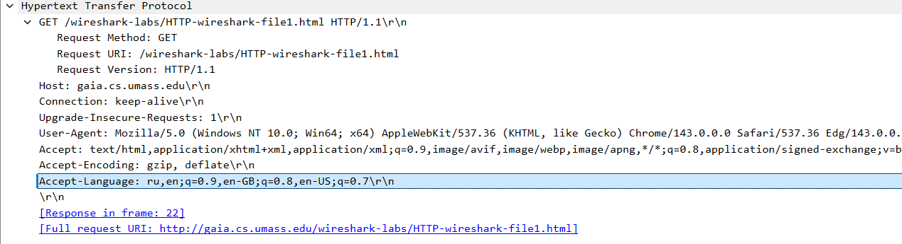
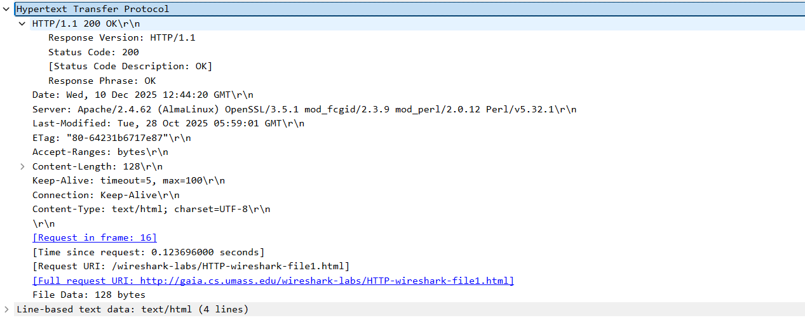
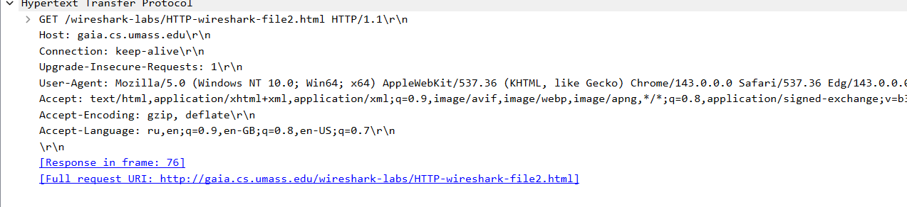
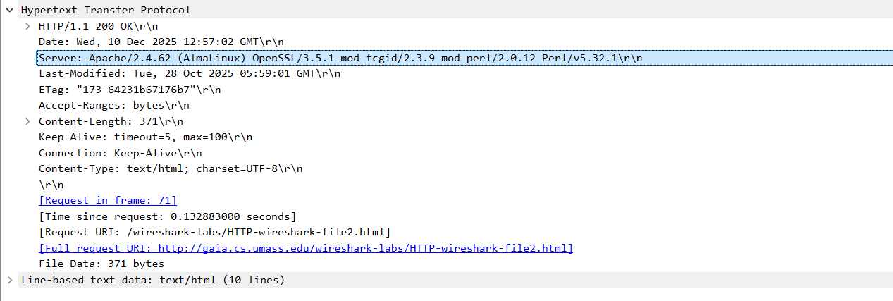
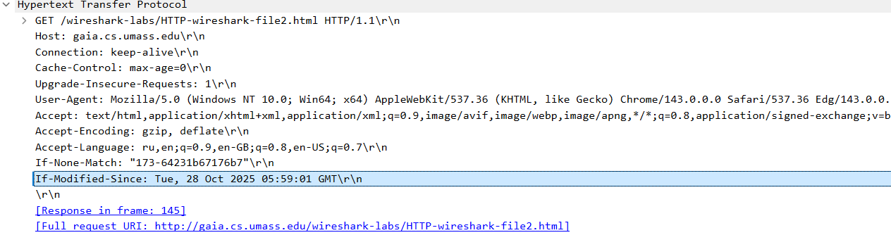
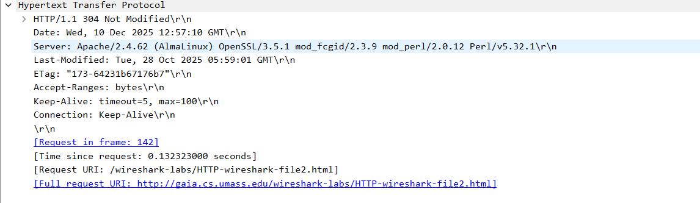
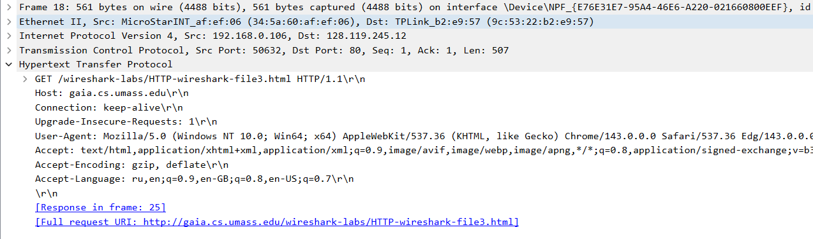
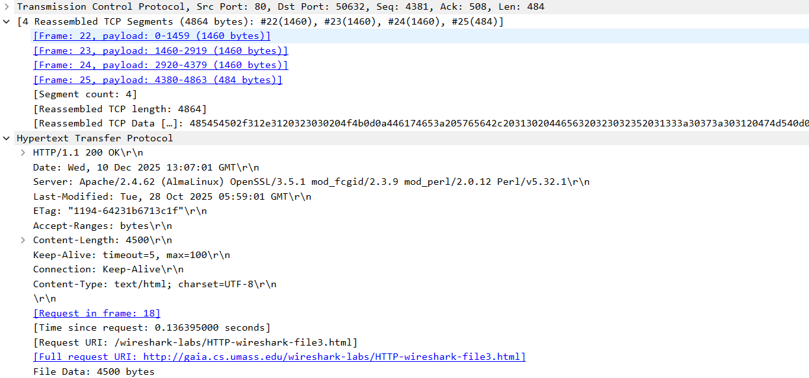
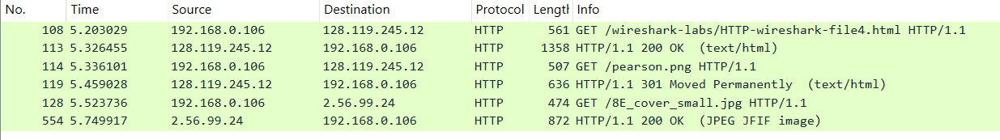
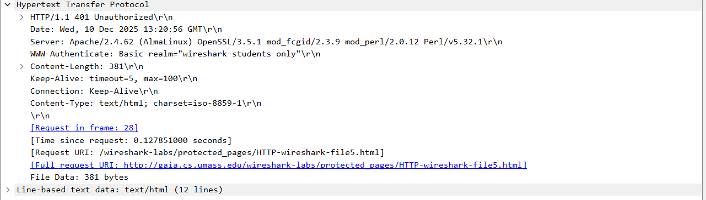

## 1-7

Файл захвата simple_get.

1. И сервер, и браузер используют HTTP 1.1.

2. Запрашиваются языки: русский, английский, английский (США), английский (Великобритания).

3. Адреса: сервер - 128.119.245.12, мой компьютер - 192.168.0.106.

4. Возвращен код состояния 200 OK

5. Дата последнего изменения 28.10.2025 05:59:01 GMT

6. Сервер вернул браузеру 128 байт текста.

7. В меню списка покетов заголовки запроса не отображаются в принципе.

## 8-11

Файл захвата if_modified_since.

8. Первый GET-запрос аналогичен полученному в п. 1-7

9. Ответ сервера возвращает HTML-документ

Дата последнего изменения 28.10.2025 05:59:01 GMT

10. Второй запрос имеет заголовок If-Modified-Since, дата установлена равной дате последнего изменения.

11. Сервер присылает ответ 304 Not Modified, без документа в теле.

## 12-15

Файл захвата big_html.

12. Был отправлен один GET-запрос, пакет №18.

13-15. Ответ отображается в результатах трассировки в пакете №25. Возвращен статус 200 ОК, Wireshark автоматически собрал его из 4 TCP-пакетов (№№ 22, 23, 24, 25).

## 16-17

Файл захвата embeds.

16. Были отправлены 3 GET запроса. 2 из них отправлены на адрес 128.119.245.12 для получения документа и логотипа, 1 на адрес 2.56.99.24 для получения обложки.

17. Загрузка осуществлялась последовательно, так как запрос на загрузку второго изображения пришел поле ответа о первом изображении.

## 18-19

Файл захвата auth.

18. На первый запрос пришел ответ 401 Unauthorized.

После заполнения в POST-запросе были отправлены данные формы входа.

19. При втором запросе добавляется заголовок Authorization, содержащий тип (Basic) и данные авторизации. Для тиипа Basic содержатся логин и пароль через двоеточие в кодировке Base64 в незашифрованном виде.

