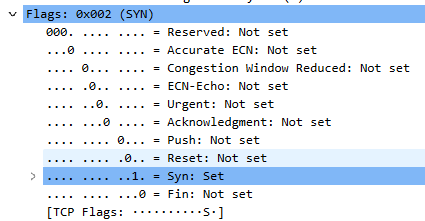
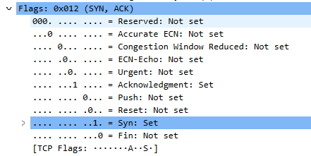
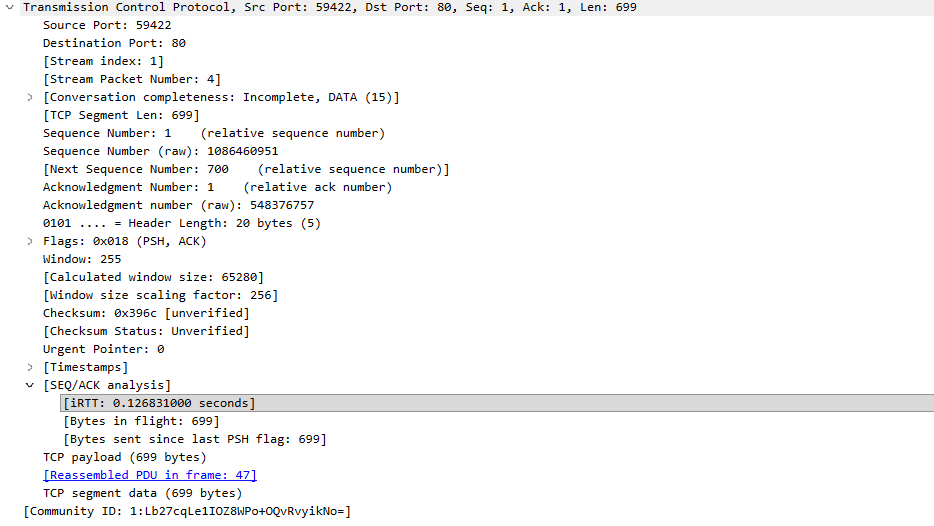
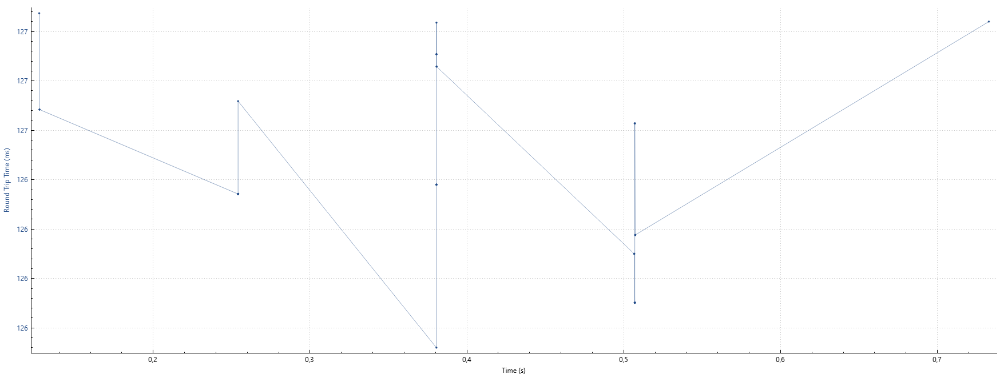
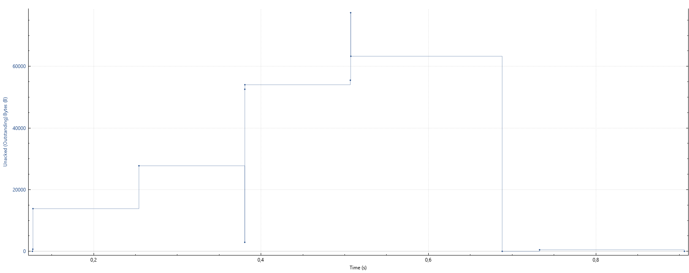
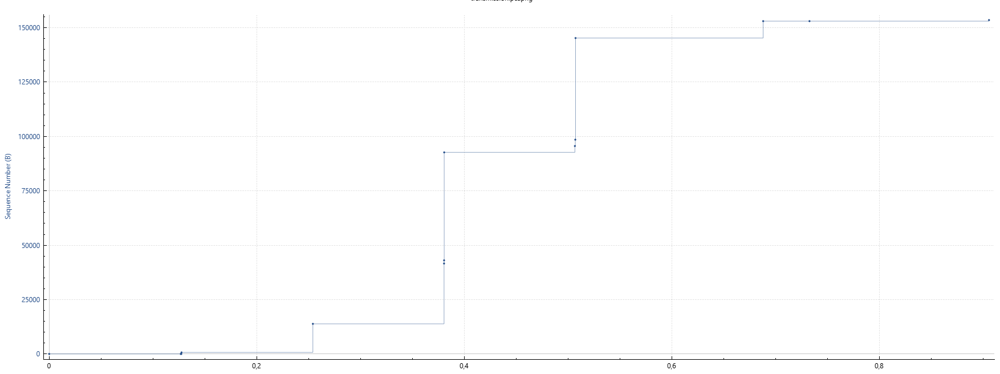

Захваченные пакеты приведены в файле transmission.

1. 3. Домашний компьютер по адресу 192.168.0.106, использует порт 59422.

2. Сервер: адрес 128.119.245.12, порт 80.

4. Установка соединения:

В SYN-пакете установлен флаг SYN, что определяет назначение пакета.

5. В SYN-ACK пакете, пришедшем в ответ, установлены флаги SYN и ACK.

Acknowledgment number задается как значение номера SYN-пакета + 1.

6. POST отправлен в пакете 18 (№4 в потоке TCP).

7. В интерфейсе Wireshark первые пакеты, содержащие запрос POST и текстовый файл обозначены номерами 18, 19, 25, 33, 34, 36. В силу размера пакетов и вероятного несоответствия видимых в захвате пакетов и реально отправленных и полученных пакетов на каждый из отправленных TCP-пакетов, начиная с 19, приходит несколько пакетов подтверждения. RTT всех отмеченных ACK примерно равны 0.126 с. Для иллюстрации приведен график зависимости RTT от времени для данной серии пакетов.

8. Длина первого TCP-сегмента с POST-запросом равна 753 б. В соответствии с MSS ожидается, что все последующие сегменты по размеру не превышают 1460 б. Значения, полученные в захвате, вероятнее всего, вызваны реконструкцией сегментов из фреймов физического уровня.

9. Сервером установлено начальное значение размера буфера приема 64240 б, что показано в SYN-ACK пакете. Размер буфера постепенно возрастает до предельного значения 65280 б. Заполнение буфера не вызывало задержек.

10. Трассировка не содержит повторно отправленных пакетов. Данный вывод сделан исходя из того, что последовательность номеров сегментов монотонно возрастает, что означает успешный прием всех пакетов с первого раза.

11. Используемая версия Wireshark помечает почти все пакеты как ACK, что значительно усложняет разделение пакетов с данными и ACK-сегментов. В соответствии с графиков зависимости числа неподтвержденный байт от времени можно сказать, что были моменты, когда подтверждался практически каждый сегмент.

12. Средняя пропускная способность вычисляется как общий переданный объем, разделенный на время передачи. В соответствии с анализом Wireshark POST-запрос и текстовый файл суммарно составляют 153018 б, переданных за (1765555735.225596000 - 1765555734.845635000) = 0.379961 с. Тогда пропускная способность составляет примерно 402720 байт/с.

13. На временной шкале отправке первого пакета потока (начало медленного старта) приведено точкой около отметки 0.125 с. Около отметки 0.5 с передача текстового файла закончилась, что означает окончание ускорения передачи, т.е. окончание управления перегрузкой.

