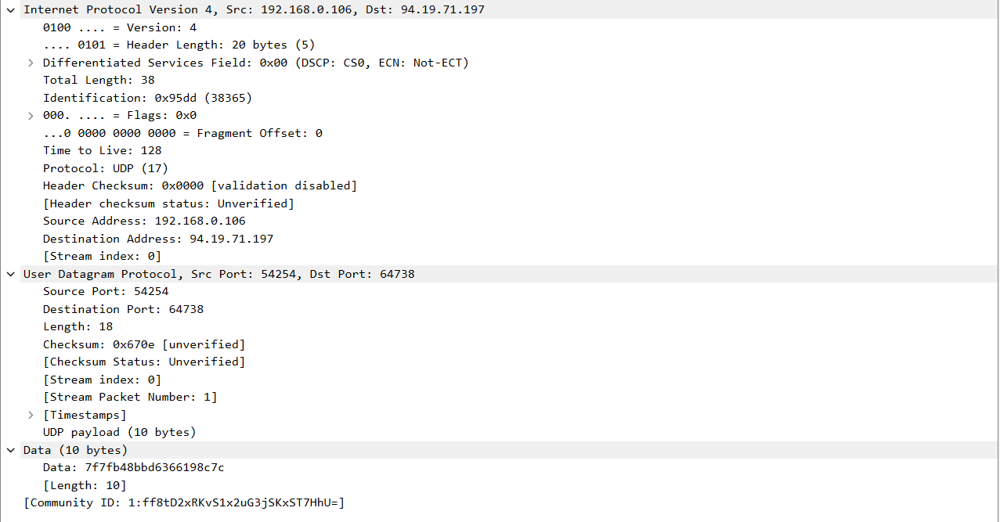
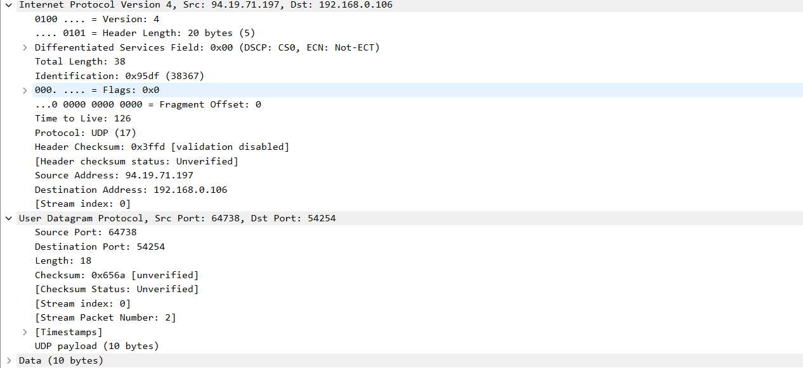

Захват приведен в файле transmission, анализируются пакета UDP с номерами в Wireshark 1 и 7. В силу особенности конфигурации сетевого взаимодействия приложения-отправителя и приложения-получателя пакеты 1 и 3 представляют собой один и тот же пакет, равно как пакеты 5 и 7.

Первый пакет:

Ответный пакет:

1. Заголовок содержит 4 поля: порт отправителя, порт получателя, длину и контрольную сумму.

2. Поля размером по 2 байта.

3. Поле Length означает длину в байтах собственно UDP-пакета, включая заголовок и не считая заголовки протоколов, в которые инкапсулирован UDP.

4. Так как значение Length ограничено 2 байтами, длина UDP-пакета может изменяться от 8 б (только заголовок) до 65535 б. Верхний предел длины полезной нагрузки - 65527 б.

5. По тем же соображением максимальный номер порта 65535.

6. В соответствии с заголовком IP-дейтаграммы номер протокола UPD 17 (или 0x11).

7. На рисунках приведены пакет UDP и ответ на него. Порты отправителя и получателя поменялись местами, так как пакет ответный.