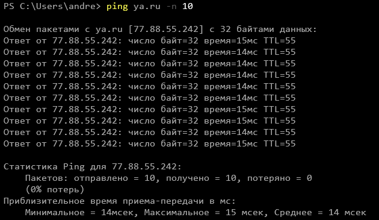
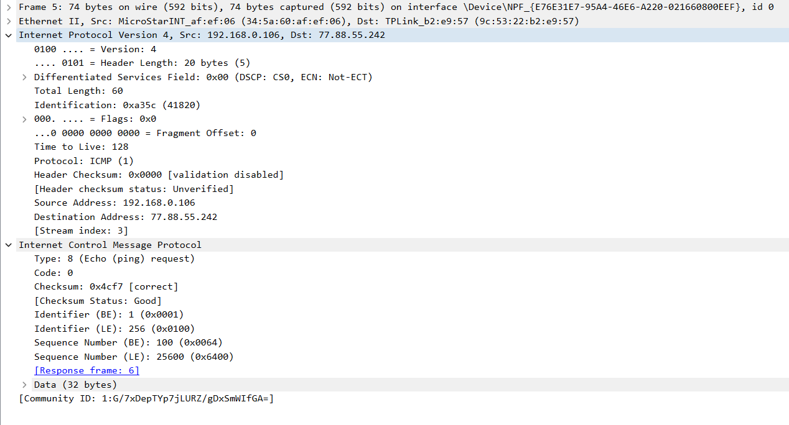
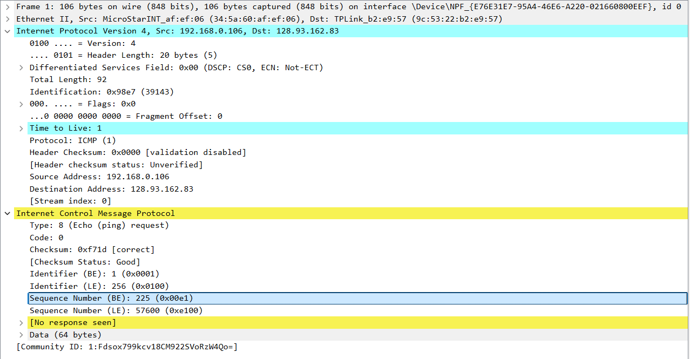
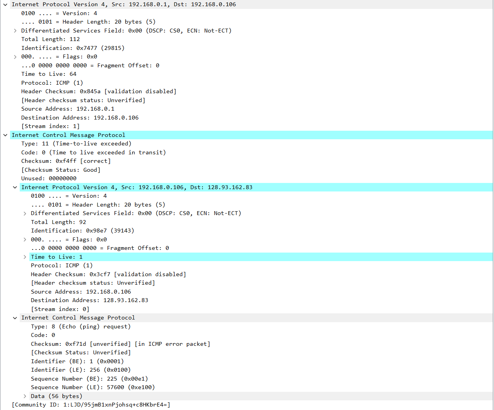
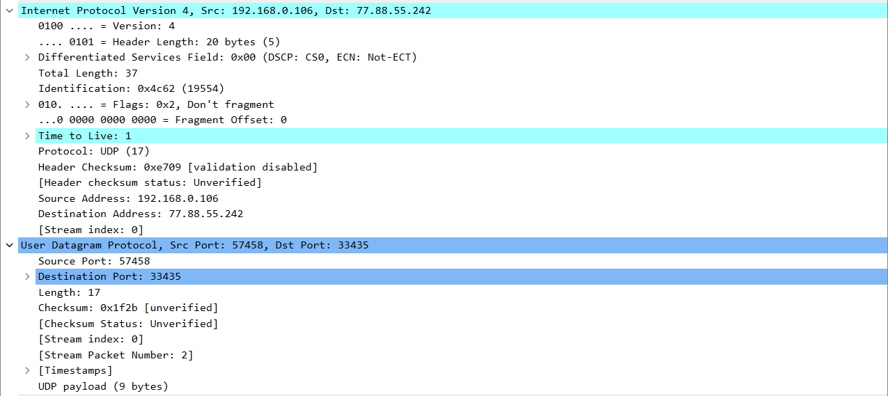

# Ping

Файл захвата ping.

Выполнение команды:

Пример запроса:

Ответ на него:

1. IP-адрес моего компьютера 192.168.0.106, IP-адрес сервера назначения 77.88.55.242.

2. Номера портов касаются взаимодействия с прикладным ПО, на прикладном уровне стека. ICMP-пакеты обрабатываются на сетевом уровне соответствующим ПО и не поднимаются выше, поэтому нет необходимости указывать номера портов.

3. Echo request: тип 8, код 0. Также присутствуют поля контрольной суммы (2 б), идентификатора (2 б) и порядкового номера (2 б).

4. Echo response: тип 0, код 0. Также присутствуют поля контрольной суммы (2 б), идентификатора (2 б) и порядкового номера (2 б).

Идентификатор и порядковый номер запроса и ответа совпадают и равны соответственно 0x1 и 0x64 (при использовании Big Endian).

## Tracert

Файл захвата tracert.

Выполнение команды: 

Пример запроса:

Пример сообщения об ошибке:

5. IP-адрес моего компьютера 192.168.0.106, IP-адрес сервера назначения 128.93.162.83.

6. В случае пересылки пакетов UDP для tracert номер протокола будет равен 17, как показано на рисунке:

7. Эхо-запрос анаолгичен таковому для ping, но на уровне IP выставлен параметр TTL.

8. Сообщение об ошибке, в отличие от эхо-ответа, не содержит номеров ID и порядкового, но содержит заголовок IP-пакета, на ошибку которого отправлено сообщение, и начало блока данных IP-пакета, содержащее заголовок ICMP.

9. Последние 3 пришедших ICMP-пакета предсталвяют собой стандартные Echo response, так как установленного TTL запросов хватает на то, чтобы дойти до адресата.

10. В рассмотренном tracert задержка резко возрастает при переходе от 6 к 7. Маршрутизаторы на концах расположены соответственно в Москве и Амстердаме.

Доп. задание: Была произведена попытка получить какой-либо ответ. Ответа не последовало.