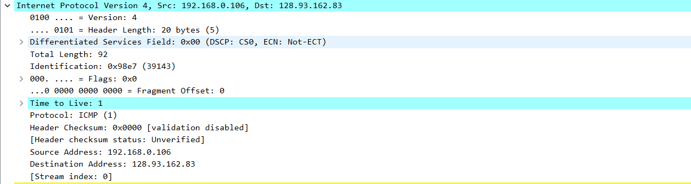
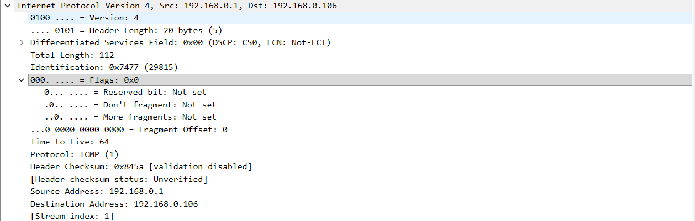
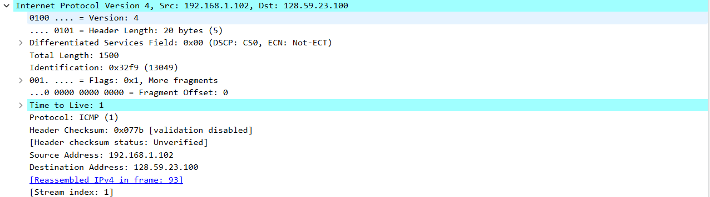
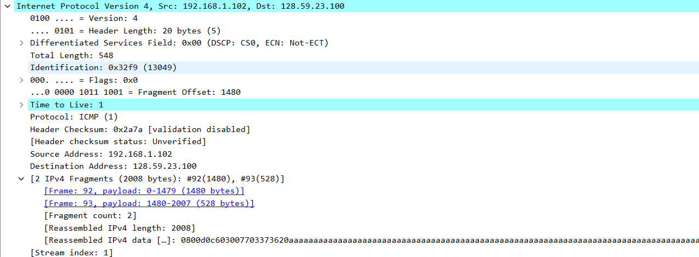
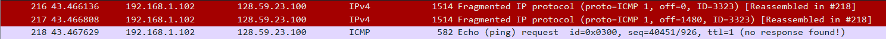

Используется файл захвата tracert.

Запрос:

1. IP-адрес компьютера 192.168.0.106.

2. Протокол 0x1 - ICMP.

3. В заголовке 20 б, как указано в поле заголовка Header Length. Так как общая длина пакета 92 б, длина полезной нагрузки 72 б.

4. Флаг наличия фрагментации More Fragments не установлен, значет пакет не фрагментирован.

5. Между пакетами ICMP-цепочки изменяется поле заголовка Identification. Между некоторыми запросами изменяется TTL, если это требует tracert. Формирование контрольной суммы заголовка отключено tracert, однако она изменялась бы в силу изменения заголовка.

6. Неизменные поля:
* Версия
* Длина заголовка
* Сервисные поля
* Протокол (используется ICMP)
* Адрес отправителя (мой компьютер)
* Адрес получателя (используется tracert до фиксированного хоста)

7. Поля Identification последовательно увеличиваются.

Первый ответ:

8. Identification содержит некое уникальное в рамках цепочки от данного отправителя значение. TTL содержит значение 64.

9. В сообщениях с данного маршрутизатора ID монотонно увеличиваются, TTL ставится тот же.

Используется готовый файл захвата, сохраненный в tracert-book.

Первая половина пакета:

Вторая половина пакета:

10. Флаг наличия фрагментации More Fragments установлен, значет пакет фрагментирован как минимум на 2 части.

11. Флаг наличия фрагментации More Fragments установлен, значет пакет фрагментирован как минимум на 2 части. Fragment offset = 0 означает, что это первый фрагмент. Общая длина дейтаграммы 1500 б.

12. Флаг наличия фрагментации More Fragments не установлен, значет больше фрагментов нет. Fragment offset = 1480, значет фрагмент не первый.

13. Между фрагментами отличаются значения поля флагов: во втором фрагменте ненулевой Fragment offset и не установлен флаг More Fragments. Также отличаются Total Length и Header checksum.

14. При установки размера пакета 3500 б дейтаграмма фрагментируется на 3 пакета:

15. Между 3 пакетами различаются значения Fragment Offset (0, 1480, 2960), Total Length (1500, 1500, 568), флаг More Fragments (1, 1, 0) и контрольная сумма заголовка.