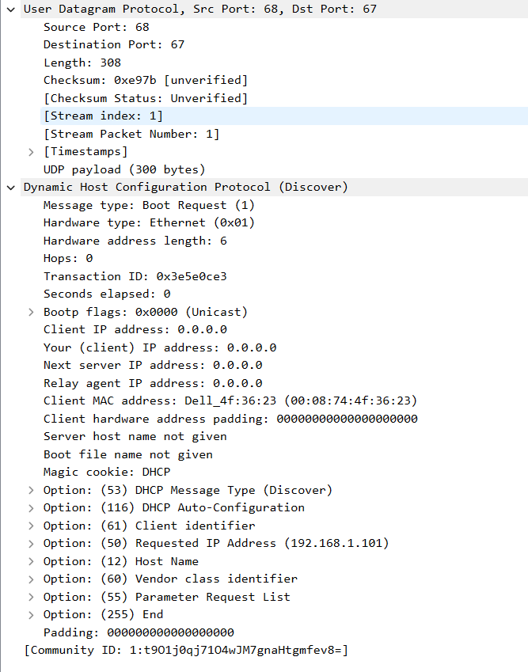
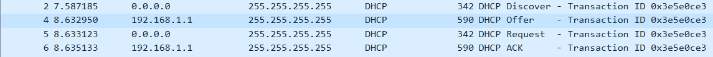
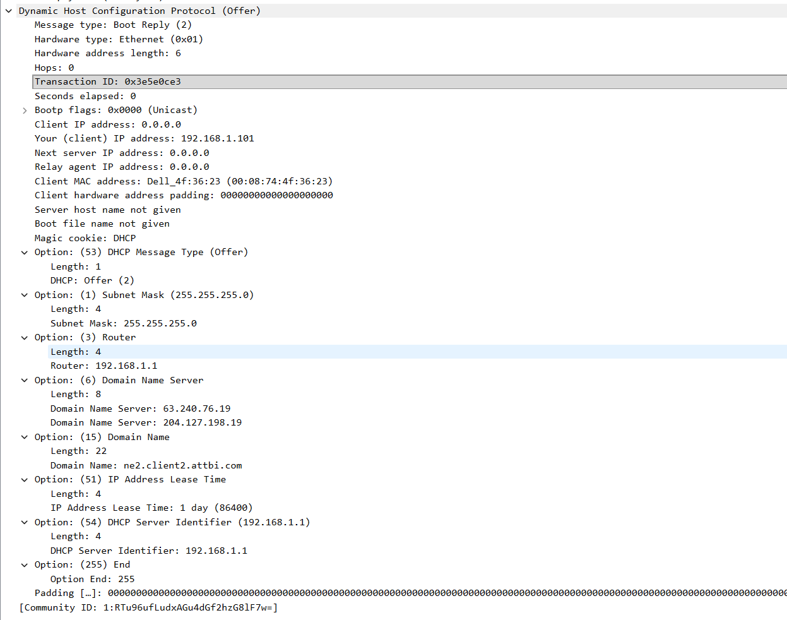
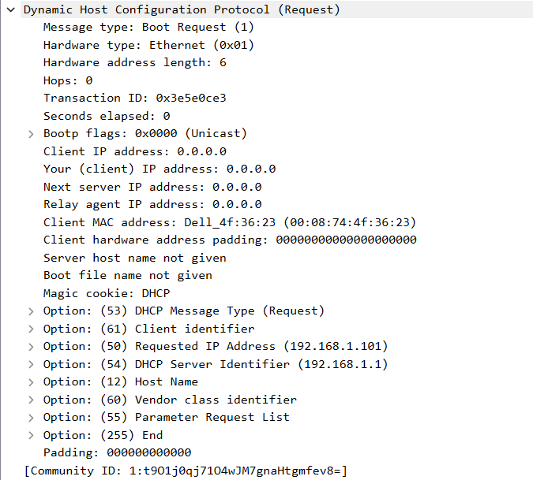
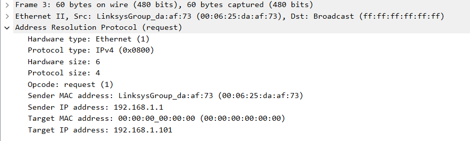

Используется приведенный с книгой файл захвата, сохраненный как dhcp.

Пример пакета DHCP Discover

1. DHCP-пакета посылаются поверх UDP, как показано на рисунке.

2. Последовательность обмена сообщений: Discover, в ответ Offer, в ответ Request, в заключение ACK.

Номера портов:
* Discover: 68 -> 67
* Offer: 67 -> 68
* Request: 68 -> 67
* ACK: 67 -> 68

3. У хоста Ethernet-адрес 00:08:74:4f:36:23.

4. На тип запроса указывает поле DHCP Message Type. Для типа Discover значение Option 53: DHCP Message Type (Discover).

5. В первых 4 сообщениях Transaction ID 0x3e5e0ce3, во втором наборе Transaction ID 0x257e55a3. Идентификтор используется для того, чтобы DHCP-сервер мог различать различные запросы.

6. Исходно хост использует IP-адрес 0.0.0.0, сервер использует свой адрес 192.168.1.1. Хост отправляет запросы на DHCP-сервер с помощью broadcast адреса 255.255.255.255. Аналогично DHCP-сервер отправляет ответы. 

7. IP-адрес сервера 192.168.1.1.

8. В сообщении DHCP Offer сервер предлагает адрес 192.168.1.101.

9. Relay agent IP address установлен в 0.0.0.0, что означает отсутствие ретранслирующего агента.

10. Адрес маршрутизатора указывает шлюз по умолчанию для узла. Маска подсети указывает, в какой подсети расположен узел.

11. Запрошенный IP-адрес указан в поле Option 50: Requested IP address.

12. Срок аренды указывает, через какой промежуток времени хост перестанет ассоциироваться с данным адресом. После этого потребуется запрашивать новый адрес или продлевать аренду данного. В данном эксперименте срок аренды 1 день (86400 с).

13. Сообщение DHCP Release сообщает серверу о том, что хост досрочно оканчивает аренду адреса и освобождает IP-адрес. На получение Release сервер ничего не отвечает. Если данное сообщение потеряется, DHCP-сервер не будет выдавать этот адрес до окончания срока аренды, т.е. адрес все еще будет считаться занятым.

14. После получения Discover сервер отправляет ARP-запрос для проверки адреса, который планируется к выдаче. В случае ответа на ARP-запрос адрес считается занятым и не будет выдан в Offer.

