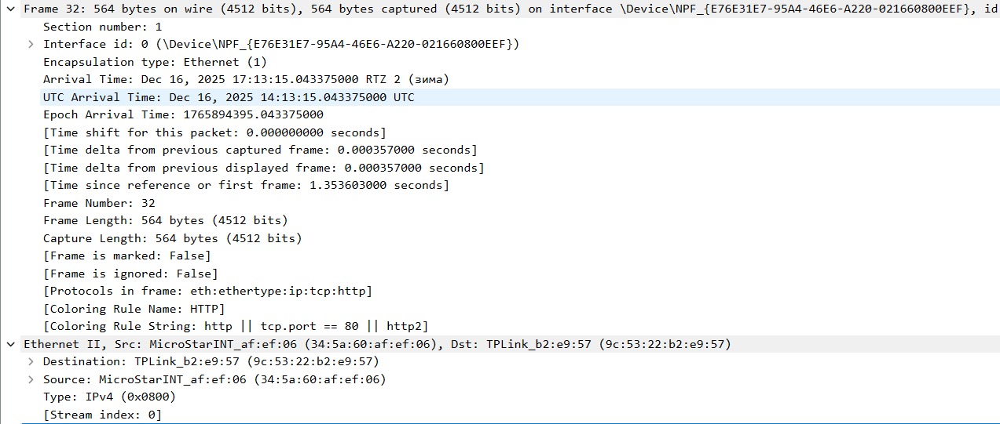
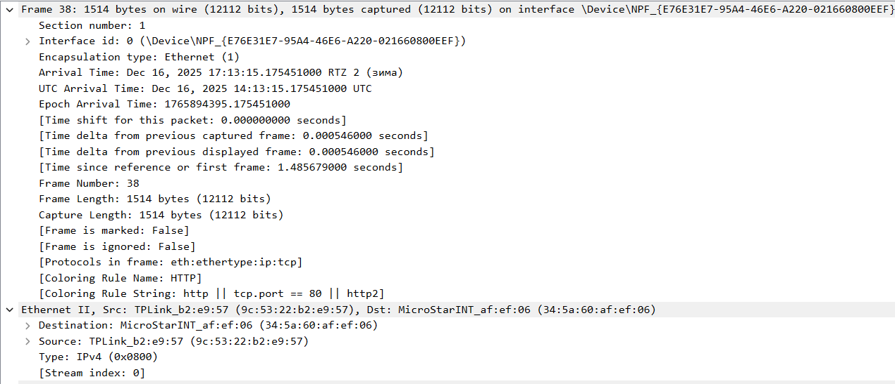
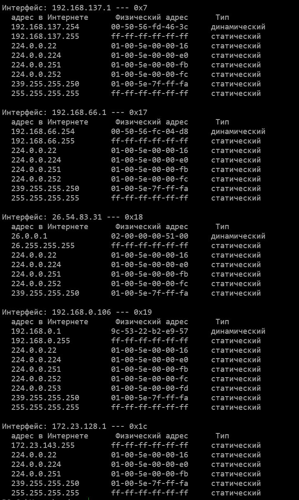
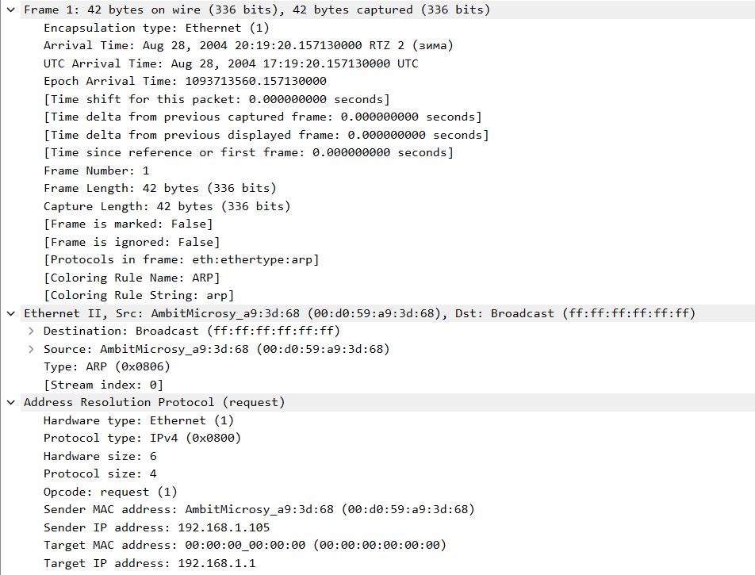
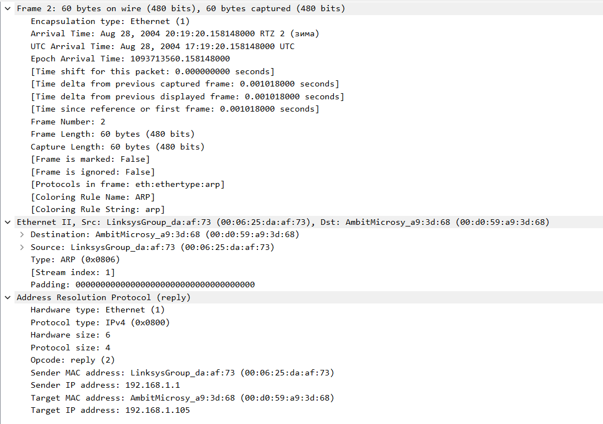

# Ethernet

Используется файл захвата ethernet.

Ethernet-фрейм запроса:

1. Адрес хоста: 34:5a:60:af:ef:06.

2. Адрес назначение: 9c:53:22:b2:e9:57. Адрес назначения соответствует маршрутизатору - шлюзу по умолчанию.

3. Тип кадра 0x0800 - протокол IPv4.

4. Начало HTTP-заголовка GET спустя 54 б.

Ethernet-фрейм начала ответа:

5. Адрес источника: 9c:53:22:b2:e9:57. Адрес источника соответствует маршрутизатору - шлюзу по умолчанию.

6. Адрес назначения : 34:5a:60:af:ef:06. Адрес назначения соответствует хосту.

7. Тип кадра 0x0800 - протокол IPv4.

8. Символ "O" из сообщения HTTP спустя 67 б. Значение больше, чем в п. 4, т.к. символ не является первым в HTTP-пакете.

# ARP

9. Содержимое ARP-кэша:

Столбцы:
* адрес в Интернете - IP-адрес
* Физический адрес - ассоциированный Ethernet-адрес
* Тип - тип записи

Далее используется готовый файл захвата, сохраненный под именем arp.

ARP-запрос:

ARP-отклик:

10. Исходный адрес - 00:d0:59:a9:3d:68, конечный адрес - broadcast ff:ff:ff:ff:ff:ff.

11. Тип кадра 0x0806 - протокол ARP.

12. a. Поле опкода начинается на 21 б.

b. ARP-запрос содержит опкод 0x1.

c. ARP-запрос содержит адрес отправителя, но не содержит IP-адрес получателя.

d. ARP-запрос содержит поля Target IP address и Target MAC address. Одно из этих полей содержит нули - тип запрашиваемого адреса. Другое поле содержит "вопросную часть".

13. a. Поле опкода начинается на 21 б.

b. ARP-отклик содержит опкод 0x2.

c. ARP-ответ хранит запрашиваемую информацию в полях об источнике сообщения - Sender IP address и Sender MAC address.

14. Исходный адрес отклика 00:06:25:da:af:73, адрес назначения 00:d0:59:a9:3d:68.

15. Запрос отправляется на broadcast, поэтому воспринимается хостом, хотя адресован не ему. Ответ не адресован рассматриваемому хосту, поэтому не появляется в захвате.
