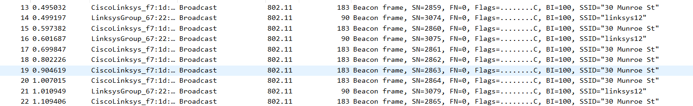
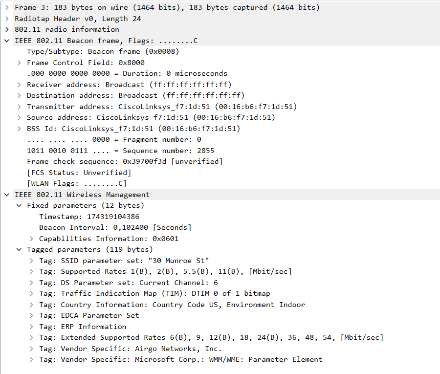
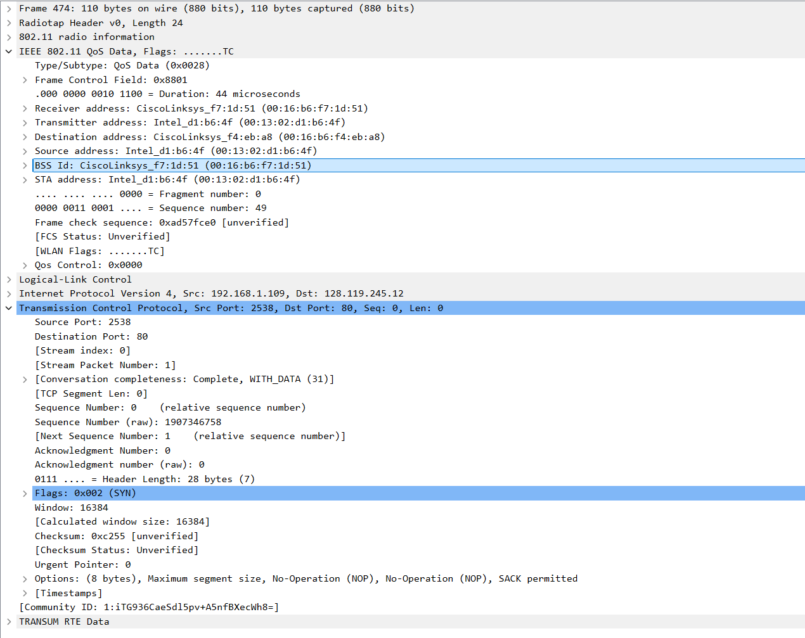
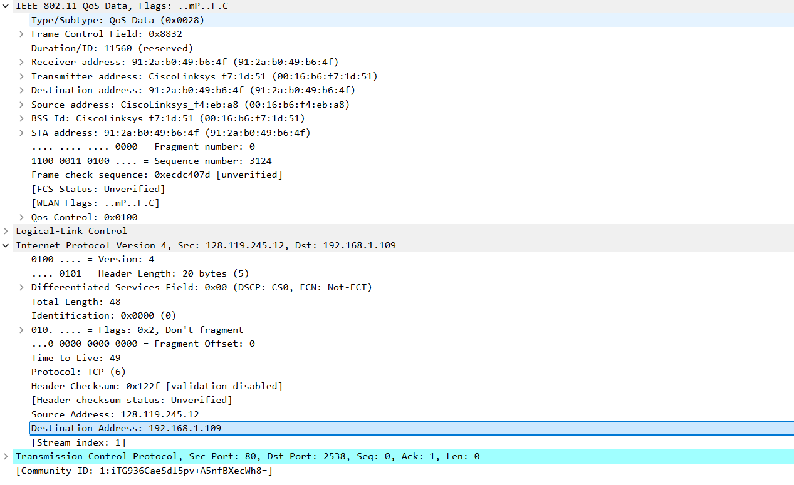
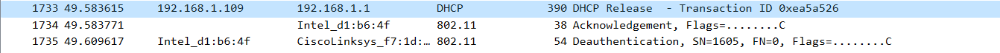
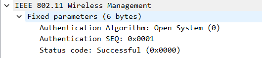
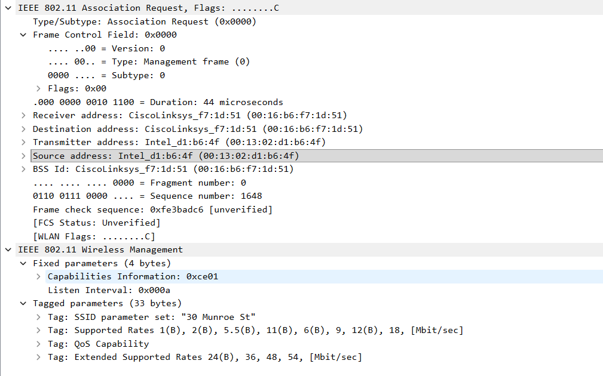
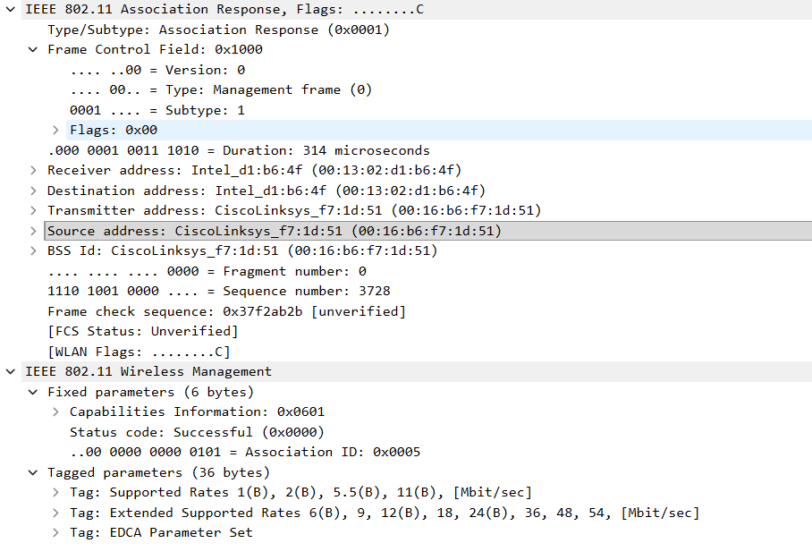
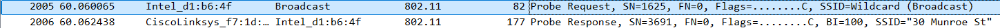

Используется готовый файл захвата, сохраненный под именем wifi.

1. Присутствуют сигнальные кадры преимущественно точек доступа "30 Munroe St" и "linksys12".

Сигнальный кадр "30 Munroe St":

2. Точка доступа "30 Munroe St" передает сигнальные кадры с интервалом 0.1024 с. Точка доступа "linksys12" заявляет тот же интервал.

3. MAC-адрес отправителя - 00:16:b6:f7:1d:51.

4. MAC-адрес назначения - broadcast ff:ff:ff:ff:ff:ff.

5. Адрес BSS - 00:16:b6:f7:1d:51, совпадает с адресом отправителя.

6. Заявляются поддерживаемые скорости: 1, 2, 5.5 и 11 Мбит/с. Также заявлены расширенные скорости 6, 9, 12, 18, 24, 36, 48 и 54 Мбит/с.

7. Запрос на начало TCP-соединения SYN:

MAC-адрес отправителя 00:13:02:d1:b6:4f (хост), получателя - 00:16:b6:f7:1d:51 (первый транзитный маршрутизатор), цели - 00:16:b6:f4:eb:a8. IP-адрес источника 192.168.1.109 - хост, IP-адрес назначения - 128.119.245.12, целевой сервер.

8. Пакет SYN-ACK:

MAC-адрес источника 00:16:b6:f4:eb:a8, соответствует адресу цели SYN, Получателя - 00:13:02:d1:b6:4f (хост). IP-адрес сервера 128.199.245.12.

9. Для завершения ассоциации с ТД выполняются запросы DHCP Release и 802.11 Deauthentication.

10. Для подключения было отправлено всего 14 кадров типа Authentication. Первые 5:

11. Запрашивается открытая аутентификация (Open System)

12. Ответа на Authentication в захвате не представлено.

13. Запрос к ТД "30 Munroe St" произошел в t=63.168087, ответ пришел в t=63.169071.

14. В t=63.169910 отправляется запрос Association Reques, Association Response приходит в t=63.192101.

Assoc. Request:

Assoc. Response:

15. Согласно отправленным пакетам и хост, и ТД поддерживают скорости 1, 2, 5.5, 11 Мбит/с как основные, 6, 9, 12, 18, 24, 32, 48, 54 Мбит/с как расширенные.

16. Рассматривается пара Probe Request для обнаружения каких-либо сетей 802.11 и Probe Response на него:

Request выслан хостом с адреса 00:13:02:d1:b6:4f, адреса получателя и BSS указаны broadcast ff:ff:ff:ff:ff:ff (активное сканирование всех доступных сетей).

Ответ на него выслан ТД "30 Munroe St" с адресом получателя, равным адресу хоста (00:13:02:d1:b6:4f), адресом источника 00:16:b6:f7:1d:51 и BSS 00:16:b6:f7:1d:51.