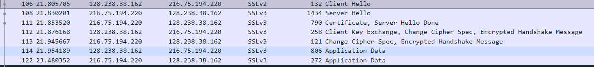
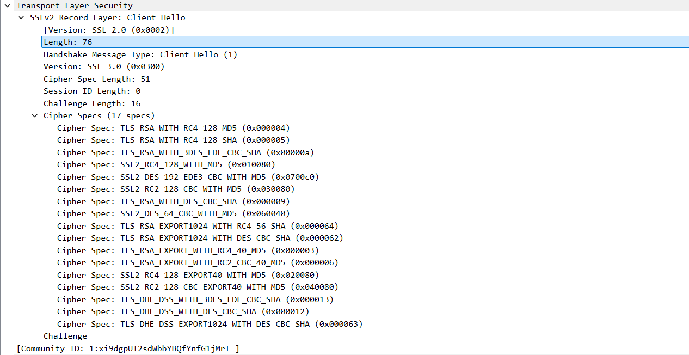
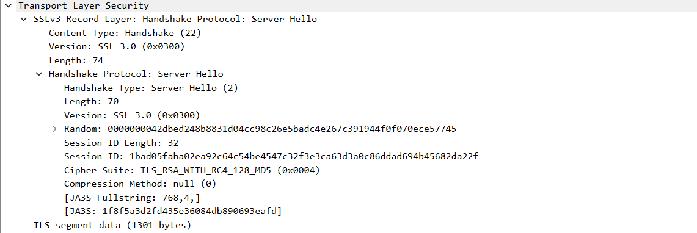
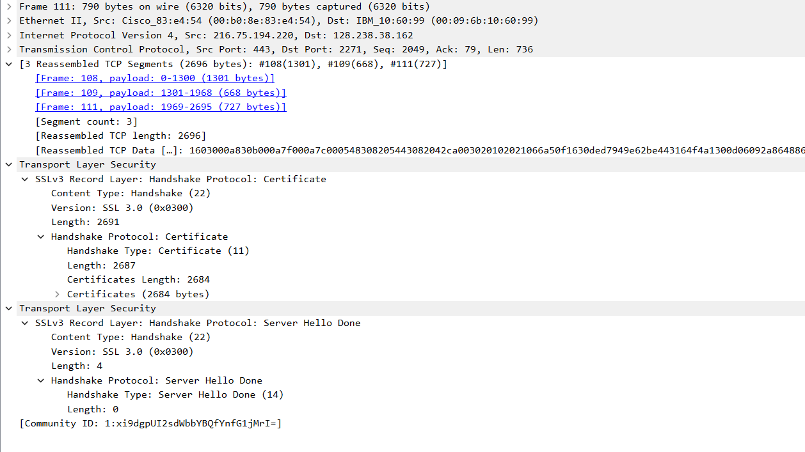
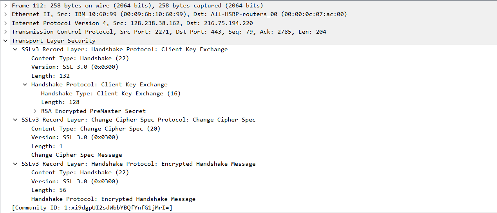

Использовался готовый файл захвата, сохраненный под именем ssl.

1. Первые 7 SSL-пакетов:

От клиента: №№ 106, 112, 114. От сервера: №№ 108, 111, 113, 122.

2. Общие поля любого SSL-сообщения: тип (1 б), версия (2 б), длина (2 б).

3. Запись Client Hello:

Тип содержимого 22 (Handshake).

4. В записи присутствует Challenge, равный 66 df 78 4c 04 8c d6 04 35 dc 44 89 89 46 99 09.

5. В записи приведены поддерживаемый крипто-наборы. Первый из них: TLS_RSA_WITH_RC4_128_MD5.
* Алгоритм шифрования открытым ключом RSA
* Алгоритм шифрования симметричными ключами RC4 (шифр Ривеста) с ключом длины 128 бит
* Алгоритм хэширования MD5

6. Запись Server Hello:

Выбран разобранный выше набор шифров.

7. В записи присутствует одноразовый номер (Rabdom), равный 0000000042dbed248b8831d04cc98c26e5badc4e267c391944f0f070ece57745. Данные номера используются при генерации ключей и позволяют гарантировать различие ключей, созданных при одинаковых запросах в одно время.

8. В записи присутствует Session ID 1bad05faba02ea92c64c54be4547c32f3e3ca63d3a0c86ddad694b45682da22f. Он необходим для идентификации и возобновления сессии в случае потери соединения и ползволяет избегать повторных длительных рукопожатий.

9. Сертификат вынесен в отдельную запись, разделенную на 3 TCP-сегмента:

10. Клиентская запись об обмене ключами:

В данной записи присутствует зашифрованный предварительный главный ключ RSA. Данный ключ используется на сервере для генерации блока ключей. Данный ключ зашифрован с применением серверного открытого ключа. Длина составляет 128 б.

11. Запись Change Cipher Spec обозначает, что все дальнейшие сообщения зашифрованы (так как сообщение равно 0x1). Длина сообщения 1 б.

12. Encrypted handshake содержит подтверждение успешного перехода на зашифрованный канал и содержит сообщение Finished, а также контрольную сумму, полученную на основе всех предыдущих сообщений. 

13. Сервер также отправляет аналогичные сообщения Change Cipher Spec и Encrypted handshake, которыми подтверждает аутентификацию и переход на зашифрованный канал.

14. Для шифрования используется алгоритм, указанный в Server Hello. Коды MAC, вероятно, содержатся в пакетах, но не выделяются Wireshark.
